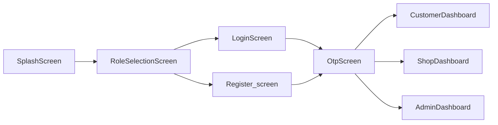

# D'Offer Client – Current State Documentation

**Version:** 1.0  
**Last updated:** As of implementation  
**Purpose:** Full flash documentation of the Flutter client as it exists today. Serves as baseline and gap reference against the system architecture vision (Doffers System Architecture Document V1).

---

## Table of Contents

1. [Product Overview](#1-product-overview)
2. [Architecture](#2-architecture)
3. [App Flow](#3-app-flow)
4. [Screens and Navigation](#4-screens-and-navigation)
5. [Data and API](#5-data-and-api)
6. [Core and UI](#6-core-and-ui)
7. [Build and Config](#7-build-and-config)

---

## 1. Product Overview

- **App name:** D'Offer  
- **Tagline:** "Discover Amazing Deals Near You."  
- **Roles:** Three roles—Customer, Shopkeeper, Admin. Single codebase; role determines post-login experience (which dashboard is shown after OTP verification).  
- **Tech stack:**
  - Flutter SDK >= 3.5.0
  - State: Provider (`theme_provider`) for theme; in-memory `AuthStore` for token and current user
  - HTTP: `http` package; all API calls via singleton `AuthService`
  - Persistence: `shared_preferences` for theme mode only (no persistent auth yet)
  - UI: `animate_do`, `google_fonts`, `flutter_svg`; Material Design with light/dark themes

Key dependencies are defined in `client/pubspec.yaml`.

---

## 2. Architecture

### 2.1 Entry Point

- **File:** `lib/main.dart`
- **Setup:** `WidgetsFlutterBinding.ensureInitialized()`, system UI overlay and preferred orientations (portrait).
- **App widget:** `ChangeNotifierProvider<ThemeProvider>` wraps `MyApp`. `MaterialApp` uses `themeMode`, `theme` (light), and `darkTheme` from `ThemeProvider`; `home` is `SplashScreen`.
- **Routing:** No named routes. Navigation uses `Navigator.push`, `Navigator.pushReplacement`, and `Navigator.pushAndRemoveUntil` with `MaterialPageRoute(builder: ...)`.

### 2.2 State

- **Auth:** `lib/services/auth_store.dart` — static `token` (String?) and `currentUser` (UserModel?). Cleared on logout. Not persisted across app restarts.
- **Theme:** `lib/providers/theme_provider.dart` — theme mode (light/dark/system) persisted via `shared_preferences`.

### 2.3 API Layer

- **Config:** `lib/services/api_config.dart`
  - `useProduction`: toggles between local and production backend.
  - Local: `http://localhost:3000/api` (web); Android emulator: `http://10.0.2.2:3000/api`; iOS/same machine: `http://localhost:3000/api`.
  - Production: `https://d-offers.onrender.com/api`.
  - Derived: `authUrl`, `shopkeeperUrl`, `adminUrl`, `metaUrl` (all under `baseUrl`).
- **Client:** All server calls go through `AuthService` singleton (`lib/services/auth_service.dart`): HTTP with Bearer token, timeout and error handling, JSON encode/decode. Response handling via `_handleResponse`.

---

## 3. App Flow

1. **Splash** — `SplashScreen` shows logo and tagline for ~3 seconds, then `pushReplacement` to `RoleSelectionScreen`.
2. **Role selection** — User picks Customer, Shopkeeper, or Admin; app navigates to `LoginScreen` with that role.
3. **Login / Register** — User enters phone; can switch to Register. On Send OTP, app calls `AuthService.sendOtp(role, phone)` then navigates to `OtpScreen` with phone and role.
4. **OTP** — User enters OTP; on Verify, app calls `AuthService.verifyOtp(role, phone, otp)`. On success, token and user are stored in `AuthStore`, and app `pushAndRemoveUntil` to the role-specific dashboard: `CustomerDashboard`, `ShopDashboard`, or `AdminDashboard`.
5. **Logout** — From any profile tab, user confirms logout; `AuthStore.clear()` then `pushAndRemoveUntil` to `RoleSelectionScreen`.

---

## 4. Screens and Navigation

### 4.1 Pre-Auth Screens

| Screen | File | Purpose |
|--------|------|---------|
| Splash | `lib/screens/splash/splash_screen.dart` | Branding and delay; then navigate to Role Selection. |
| Role Selection | `lib/screens/role_selection/role_selection_screen.dart` | Choose Customer, Shopkeeper, or Admin; navigate to Login with role. |
| Login | `lib/screens/auth/login_screen.dart` | Enter phone, send OTP; link to Register. On success → OtpScreen. |
| Register | `lib/screens/auth/Register_screen.dart` | Signup (name, phone, pincode, etc.) then OTP flow; on success → OtpScreen. |
| OTP | `lib/screens/auth/otp_screen.dart` | Enter OTP; verify; on success → role-specific dashboard. |

### 4.2 Customer Dashboard

- **Container:** `lib/screens/customer/customer_dashboard.dart` — `Scaffold` with `IndexedStack` for tab body and `BottomNavigationBar` (Home, Offers, Favorites, Profile). Back key handled with exit dialog (`PopScope`).
- **Tabs:**
  - **Home:** `lib/screens/customer/customer_home_tab.dart` — Greeting, search bar, featured offers (horizontal list), "Discover More" CTA. "View All" / filter icon navigate to Offers tab.
  - **Offers:** `lib/screens/customer/customer_offers_tab.dart` — Full list with search, sort (newest / most liked / highest discount), filters (state, city, pincode); uses `OfferCard`.
  - **Favorites:** `lib/screens/customer/customer_favorites_tab.dart` — Liked offers list; "Browse Offers" navigates to Offers tab.
  - **Profile:** `lib/screens/customer/customer_profile_tab.dart` — Avatar, name, phone; list of options that push to common pages or trigger logout.

Profile options: Edit Profile, My Addresses, Settings, Help & Support, About (all push to common full-screen pages); Logout (dialog then clear auth and go to Role Selection).

### 4.3 Shopkeeper Dashboard

- **Container:** `lib/screens/shopkeeper/shop_dashboard.dart` — Bottom nav: Dashboard, Offers, Leads, Shop. FAB "Add Offer" on Offers tab.
- **Tabs:**
  - **Dashboard:** `ShopHomeTab` — Summary and own offers list.
  - **Offers:** `OffersManagementTab` — List of shop’s offers; create/edit/delete via dialog.
  - **Leads:** `LeadsTab` — Placeholder (no backend integration yet).
  - **Shop:** `ShopProfileTab` — Uses `lib/screens/shopkeeper/shop_profile_body.dart`: avatar, shop name, Edit Shop Profile (dialog), Business Details (same dialog), Settings, Help & Support, About (common pages), Logout.

### 4.4 Admin Dashboard

- **Container:** `lib/screens/admin/admin_dashboard.dart` — Bottom nav: Dashboard, Users, Shopkeepers, Profile.
- **Tabs:**
  - **Dashboard:** `AdminHomeTab` — Stats cards (from `getAdminStats`).
  - **Users:** `UsersManagementTab` — List users (role filter).
  - **Shopkeepers:** `ShopkeepersApprovalTab` — List shopkeepers (pending/approved); Approve/Reject actions.
  - **Profile:** Edit Profile, Security, Settings, Help & Support, About (common pages), Logout.

### 4.5 Common Full-Screen Pages

| Page | File | Purpose |
|------|------|---------|
| Edit Profile | `lib/screens/common/edit_profile_page.dart` | User name, pincode, address; save via `AuthService.updateCurrentUser`. Used by Customer and Admin. |
| My Addresses | `lib/screens/common/addresses_page.dart` | View/edit primary address (address, pincode). Used by Customer. |
| Settings | `lib/screens/common/settings_page.dart` | Appearance (theme toggle), notifications switch, language placeholder. |
| Help & Support | `lib/screens/common/help_support_page.dart` | Contact (email/phone copy), FAQ expansion tiles. |
| About | `lib/screens/common/about_page.dart` | App name, tagline, short description, version. |
| Security | `lib/screens/common/security_page.dart` | Change password, 2FA, active sessions placeholders. Used by Admin. |

All opened via `Navigator.push(MaterialPageRoute(...))`.

---

## 5. Data and API

### 5.1 Models

- **UserModel** (`lib/models/user_model.dart`): id, name, phone, role (enum), pincode, city, state, address, approvalStatus. `fromJson` / role helpers in same file.
- **OfferModel** (`lib/models/offer_model.dart`): id, shopkeeperId, title, description, discountType, discountValue, validFrom, validTo, status, likesCount, isLiked, createdAt, updatedAt. `fromJson`, `copyWith`.
- **ShopkeeperProfileModel** (`lib/models/shopkeeper_profile_model.dart`): id, userId, shopName, address, pincode, city, category, description.
- **UserRole** (`lib/models/role_enum.dart`): customer, shopkeeper, admin; `roleFromString` / `roleToString`.

### 5.2 AuthService Methods (Summary)

- **Auth:** signup, sendOtp, verifyOtp, fetchCurrentUser, updateCurrentUser (name, address, pincode).
- **Shopkeeper:** getShopkeeperProfile, upsertShopkeeperProfile; getShopkeeperOffers, createOffer, updateOffer, deleteOffer.
- **Customer:** getCustomerOffers(state, city, pincode), toggleOfferLike(offerId), getLikedOffers.
- **Meta:** lookupPincode(pincode) — state, district, areas.
- **Admin:** getAdminStats, getUsers(role, limit, skip), getShopkeepers(status), approveShopkeeper(id), rejectShopkeeper(id).

API contract details: see repository-level `API_DOCUMENTATION.md` (if present).

---

## 6. Core and UI

### 6.1 Core

- **Constants:** `lib/core/constants/app_colors.dart` (primary, surfaces, gradients, light/dark), `lib/core/constants/app_strings.dart` (app name, tagline, role labels, auth, dashboard strings).
- **Theme:** `lib/core/theme/app_theme.dart` (lightTheme, darkTheme).
- **Utils:** `lib/core/utils/theme_helper.dart` (background gradient, isDark, surface/text colors), `lib/core/utils/dialog_helper.dart` (exit dialog, logout dialog, success/error snackbars).

### 6.2 Widgets

- **theme_toggle** — Toggle theme mode; used in app bar and settings.
- **profile_option_tile** — Reusable profile menu list tile (icon, title, destructive style, onTap); used in Customer, Shopkeeper, and Admin profile tabs.
- **offer_card** — Card for an offer (title, description, discount, validity, like button); used in Home, Offers, Favorites.
- **gradient_card** — Gradient-styled card used on role selection and elsewhere.
- **custom_button** — Custom button widget for auth and actions.
- **custom_text_field** — Custom text field for forms.

---

## 7. Build and Config

- **Project path:** `client/` (Flutter project).
- **Key config:** `lib/services/api_config.dart` — set `useProduction` to `true` for production backend; Android emulator uses `10.0.2.2:3000` for local API.
- **Run:** From `client/`: `flutter run`. Ensure backend is running on the configured URL when testing with real API.

---

*End of Current State Documentation*
