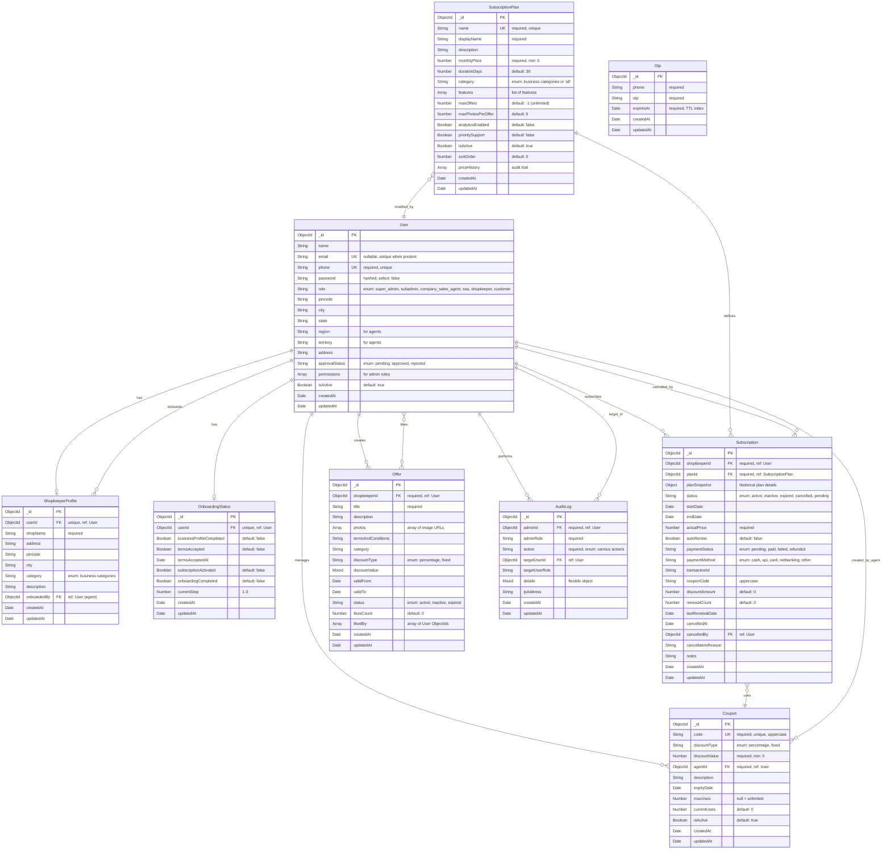

# D-Offers Platform - Entity Relationship Diagram

## Database Schema Overview

This document provides a comprehensive Entity Relationship Diagram (ERD) for the D-Offers platform, showing all entities, their attributes, and relationships.

## ER Diagram (Mermaid)

## Relationships Explained

### User Relationships
1. **User → ShopkeeperProfile** (1:1)
   - Each shopkeeper user has one profile
   - Profile contains business details

2. **User → OnboardingStatus** (1:1)
   - Tracks onboarding progress for shopkeepers
   - Unique per user

3. **User → Subscription** (1:N)
   - Shopkeepers can have multiple subscriptions over time
   - Only one active subscription at a time

4. **User → Offer** (1:N)
   - Shopkeepers create multiple offers
   - Customers can like offers (M:N through likedBy array)

5. **User → Coupon** (1:N)
   - Agents (SSA, Company Sales Agent) create coupons
   - Tracked via agentId

6. **User → ShopkeeperProfile (onboardedBy)** (1:N)
   - Agents onboard shopkeepers
   - Tracks which agent brought in which shopkeeper

7. **User → AuditLog** (1:N)
   - Admins perform actions (logged)
   - Users can be targets of actions

### Subscription Relationships
1. **SubscriptionPlan → Subscription** (1:N)
   - Plans define subscription terms
   - Subscriptions reference plans

2. **Subscription → Coupon** (N:1)
   - Subscriptions can use coupon codes
   - Tracked via couponCode field

3. **Subscription → User (cancelledBy)** (N:1)
   - Tracks who cancelled the subscription

### Other Relationships
1. **SubscriptionPlan → User (priceHistory)** (N:1)
   - Tracks admin who changed prices

## Indexes

### User
- `phone` (unique)
- `email` (sparse, unique when present)
- `role + approvalStatus` (compound)

### ShopkeeperProfile
- `userId` (unique)
- `category`

### Subscription
- `shopkeeperId`
- `status`
- `endDate`
- `planId`

### SubscriptionPlan
- `name` (unique)
- `isActive`
- `category`

### Offer
- `shopkeeperId`
- `status`
- `validTo`

### Coupon
- `code` (unique)
- `agentId`
- `isActive`

### Otp
- `phone`
- `expiresAt` (TTL - auto-delete)

### OnboardingStatus
- `userId` (unique)

### AuditLog
- `adminId + createdAt` (compound, descending)
- `targetUserId`
- `action`

## Business Rules

### User Roles
- **super_admin**: Full system access
- **subadmin**: Limited admin access
- **company_sales_agent**: Onboards shopkeepers, creates coupons
- **ssa** (State Sales Agent): Onboards shopkeepers, creates coupons
- **shopkeeper**: Creates offers, manages subscriptions
- **customer**: Views and likes offers

### Approval Flow
- Shopkeepers require approval (approvalStatus: pending → approved/rejected)
- Other roles are auto-approved

### Subscription Lifecycle
1. **pending**: Created but not paid
2. **active**: Paid and within validity period
3. **expired**: Past endDate
4. **cancelled**: Manually cancelled
5. **inactive**: Deactivated

### Coupon Validation
- Must be active (isActive = true)
- Not expired (expiryDate > now or null)
- Usage limit not exceeded (currentUses < maxUses or maxUses = null)

### Onboarding Steps
1. Business Profile (ShopkeeperProfile)
2. Terms & Conditions (OnboardingStatus.termsAccepted)
3. Subscription Activation (Subscription with status: active)

## Data Integrity

### Cascading Considerations
- Deleting a User should handle:
  - ShopkeeperProfile (if shopkeeper)
  - OnboardingStatus
  - Subscriptions
  - Offers
  - Audit logs (keep for compliance)

### Soft Deletes
- Users: Use `isActive` flag instead of hard delete
- Offers: Use `status` field
- Subscriptions: Use `status` field
- Coupons: Use `isActive` flag

## Performance Considerations

### Frequently Queried Fields
- User.phone (login)
- User.role + approvalStatus (admin dashboards)
- Subscription.shopkeeperId + status (active subscriptions)
- Offer.shopkeeperId + status (active offers)
- Coupon.code (coupon validation)

### Denormalization
- Subscription.planSnapshot: Stores plan details at subscription time
- Subscription.couponCode: Stores coupon code instead of reference
- Offer.likesCount: Cached count for performance

### TTL Indexes
- Otp.expiresAt: Auto-deletes expired OTPs

## Future Enhancements

### Potential New Entities
1. **Notification**: Push notifications to users
2. **Payment**: Detailed payment transaction records
3. **Analytics**: Offer view/click tracking
4. **Review**: Customer reviews for shops
5. **Category**: Separate category management
6. **Media**: Centralized media/image management

### Potential Relationships
- User → Notification (1:N)
- Subscription → Payment (1:N)
- Offer → Analytics (1:N)
- ShopkeeperProfile → Review (1:N)
