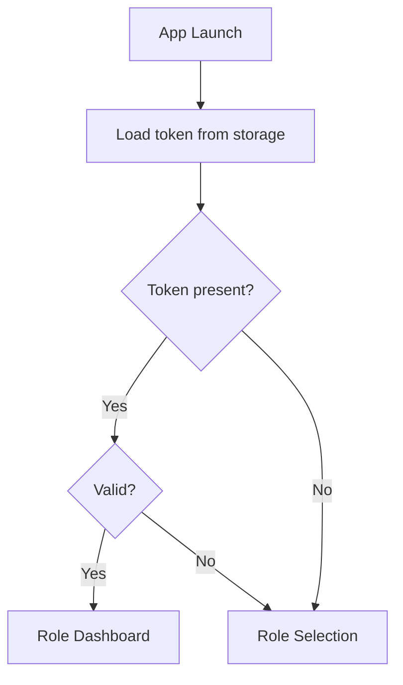
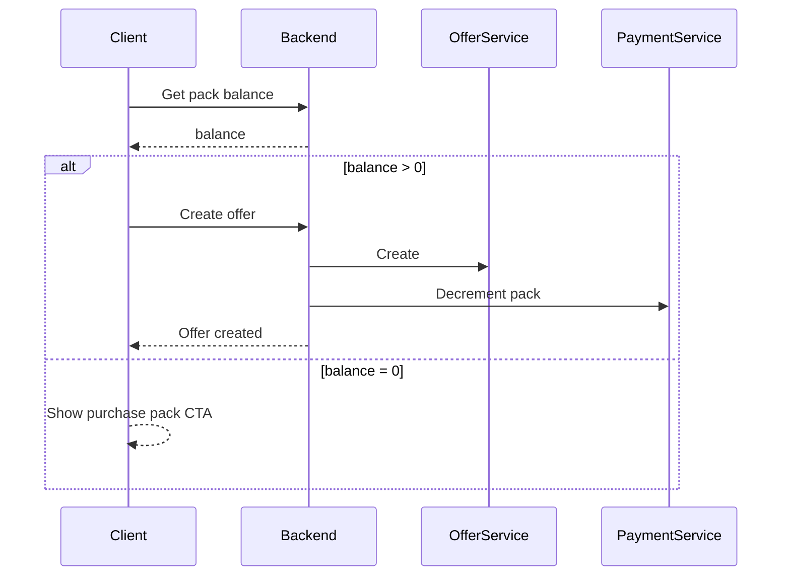
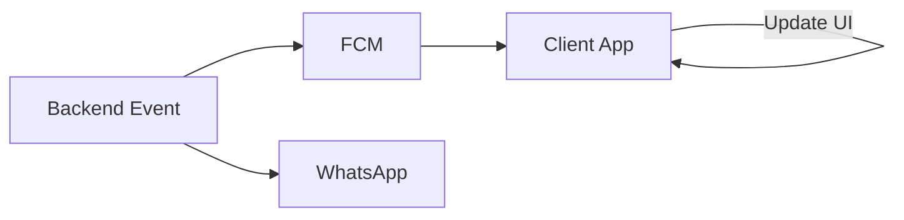
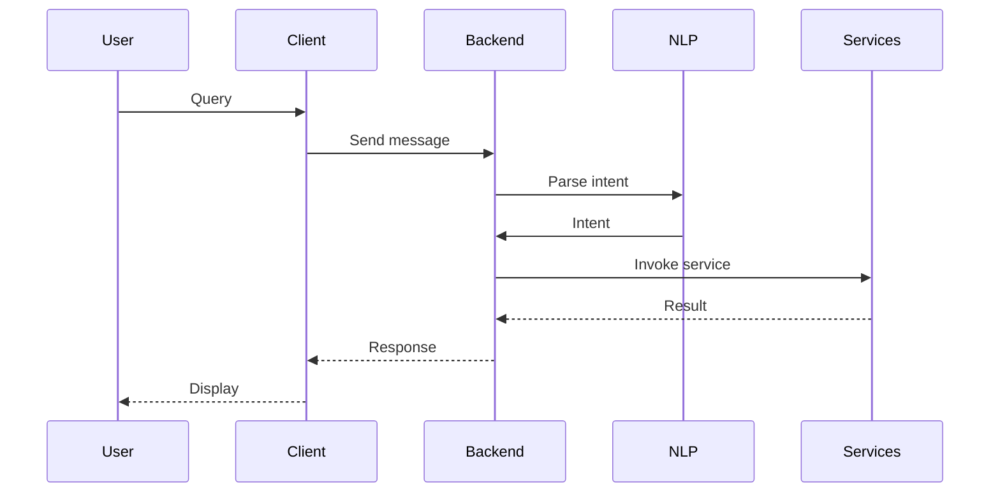

# D'Offer Feature Requirements and Roadmap

**Source:** Doffers System Architecture Document V1 (PDF), Phases 1–3.  
**Purpose:** Flushed feature documentation and requirements for what we are doing next. Aligned with PDF roadmap; includes client-specific acceptance criteria and technical notes.

---

## Table of Contents

1. [Roadmap Overview](#1-roadmap-overview)
2. [Phase 1: Core Offers, Subscription Packs, Basic Filtering](#2-phase-1-core-offers-subscription-packs-basic-filtering)
3. [Phase 2: Campaign Engine, WhatsApp Integration](#3-phase-2-campaign-engine-whatsapp-integration)
4. [Phase 3: AI Text and Banner, Scratch Card, AI Chatbot](#4-phase-3-ai-text-and-banner-scratch-card-ai-chatbot)
5. [Use Case Implementation Status](#5-use-case-implementation-status)
6. [Per-Feature Template](#6-per-feature-template)
7. [Out of Scope](#7-out-of-scope)

---

## 1. Roadmap Overview

| Phase | Focus | Cross-cutting |
|-------|--------|----------------|
| **Phase 1** | Core offers (done), subscription packs, basic filtering enhancements | Persistent auth, optional push registration |
| **Phase 2** | Campaign engine, WhatsApp and in-app notifications | Push notifications (FCM), campaign alerts |
| **Phase 3** | AI text and banner, scratch card, AI chatbot | — |

---

## 2. Phase 1: Core Offers, Subscription Packs, Basic Filtering

### 2.1 Baseline (Already in Client)

- Offers CRUD (shopkeeper): create, update, delete offers  
- Customer: browse offers, like/unlike, view favorites  
- Filters: state, city, pincode for customer offers  
- Admin: approve/reject shopkeepers, list users  
- User and shopkeeper profile management  

### 2.2 To Add

#### Subscription Packs

- **User story:** As a shopkeeper, I can purchase an offer pack so that I can create a limited number of active offers.
- **Functional requirements:**
  - Backend: offer pack product (e.g. 5, 10, 25 offers), wallet or payment stub, pack balance per shopkeeper.
  - Before creating an offer: validate that shopkeeper has pack balance; decrement on create.
  - Client: pack purchase screen or in-app flow; display remaining offers in pack; block create offer when balance is zero with CTA to purchase.
- **Technical notes:** New backend endpoints (e.g. packs list, purchase, balance); client: new screen or dialog, call before createOffer.

#### Persistent Auth

- **User story:** As a user, I remain logged in after closing the app so that I do not have to enter OTP again.
- **Functional requirements:**
  - Persist token (and optionally current user snapshot) in secure storage or shared_preferences.
  - On app launch: read token; if present and valid (e.g. call /auth/me or validate JWT), navigate to role-specific dashboard; else show Role Selection.
  - Logout clears persisted auth.
- **Technical notes:** Client: flutter_secure_storage or shared_preferences; restore AuthStore on startup; handle token expiry (re-login or refresh if implemented).

#### Push Registration (Optional for Phase 1)

- Register device token with backend (FCM); no campaign sending yet. Enables Phase 2 campaign alerts.

### 2.3 Offer Creation with Pack Check

---

## 3. Phase 2: Campaign Engine, WhatsApp Integration

### 3.1 Campaign Engine

- **User story:** As a shopkeeper, I can run a campaign (select offer, audience, schedule) so that targeted customers receive my offer.
- **Functional requirements:**
  - Shopkeeper selects offer, audience segment (e.g. by pincode/city/state), optional schedule.
  - Backend: Campaign Service — validate offer, fetch audience (UserService/CustomerDB), cost calculation, deduct from wallet (Payment Service), schedule; trigger Notification Service.
  - Client: Campaign creation screen (offer picker, segment filters, date/time), campaign list, status.
- **Technical notes:** New backend Campaign API; client: new screens, AuthService methods for campaign CRUD and list.

**Campaign sequence (from PDF):** See `SYSTEM_ARCHITECTURE.md` §6.1.

### 3.2 WhatsApp and In-App Notifications

- **User story:** As a customer, I receive campaign alerts (in-app and optionally WhatsApp) for offers in my area.
- **Functional requirements:**
  - Notification Service sends messages (push via FCM, in-app; optionally WhatsApp).
  - Client: FCM integration; handle foreground/background; show notification and/or in-app banner; deep link to offer when applicable.
- **Technical notes:** Backend: FCM server key, device token storage; client: firebase_messaging (or equivalent), store token, handle onMessage/onLaunch.

---

## 4. Phase 3: AI Text and Banner, Scratch Card, AI Chatbot

### 4.1 AI Text and Banner

- **User story:** As a shopkeeper, I can generate campaign text and a banner using AI so that I can launch campaigns faster.
- **Functional requirements:**
  - Inputs: product/shop name, discount %, tone, language (text); shop name, offer %, theme (banner).
  - Backend: AIService calls (e.g. OpenAI) for text and image; store banner (e.g. S3); return URLs/text to client.
  - Client: UI to enter params, trigger generation, show preview, use in campaign creation.
- **Technical notes:** New backend AI endpoints; client: new screens or dialogs, display generated content.

### 4.2 Scratch Card

- **User story:** As a customer, I can scratch to reveal an offer so that redemption is engaging.
- **Functional requirements:**
  - Offer type or redemption mechanic: scratch card; backend validates and returns offer content on “scratch”/redeem.
  - Client: scratch interaction (e.g. gesture to reveal), call redemption API, show offer.
- **Technical notes:** Backend: scratch card model, redemption API; client: scratch widget, API call on complete.

### 4.3 AI Chatbot Assistant

- **User story:** As a shopkeeper, I can ask the assistant to create a campaign, check pack balance, or get analytics in natural language.
- **Functional requirements:**
  - User query → NLP engine → intent classification → service invocation (campaign, balance, analytics) → response.
  - Client: chat UI; send message to backend; display assistant reply and optional actions.
- **Technical notes:** Backend: NLP/LLM, intent routing, service calls; client: chat screen, stream or single response.

---

## 5. Use Case Implementation Status

| Role | Use case | Phase | Status | Client screen / API |
|------|----------|-------|--------|----------------------|
| Customer | ViewOffers | — | Done | CustomerHomeTab, CustomerOffersTab; getCustomerOffers |
| Customer | LikeOffer | — | Done | OfferCard; toggleOfferLike, getLikedOffers |
| Customer | RequestCallback | Later | Planned | — |
| Customer | NegotiateOffer | Later | Planned | — |
| Shopkeeper | CreateOffer | — | Done | OffersManagementTab; createOffer, updateOffer, deleteOffer |
| Shopkeeper | RunCampaign | Phase 2 | Planned | New campaign screens; Campaign API |
| Shopkeeper | ViewAnalytics | Phase 1/2 | Planned | Analytics UI; stats API |
| Shopkeeper | PurchasePack | Phase 1 | Planned | Pack purchase flow; Payment/pack API |
| Admin | ApproveShop | — | Done | ShopkeepersApprovalTab; approveShopkeeper, rejectShopkeeper |
| Admin | ManageUsers | — | Done | UsersManagementTab; getUsers |
| Admin | ViewRevenue | Later | Planned | Revenue dashboard |

---

## 6. Per-Feature Template

For each new feature, document:

1. **Title and short description** — What the feature is.
2. **User story / acceptance criteria** — e.g. “As a [role], I want [action] so that [benefit]”; list acceptances.
3. **Functional requirements** — Bullet list of must-haves.
4. **Technical notes** — Client vs backend responsibilities; new endpoints; new dependencies (e.g. FCM, secure storage).
5. **Diagram** — Mermaid flowchart or sequence where it clarifies flow (e.g. auth, campaign, notification).

---

## 7. Out of Scope

The following are explicitly **out of scope** for the current roadmap (Phases 1–3 as above):

- Featured listings (paid prominence)  
- Sponsored offers  
- Multi-language / localization  
- In-app chat (user-to-user or user-to-shop)  
- Full payment gateway (beyond wallet and pack purchase)  
- Alternative auth (e.g. social login) unless specified later  

---

*End of Feature Requirements and Roadmap*
