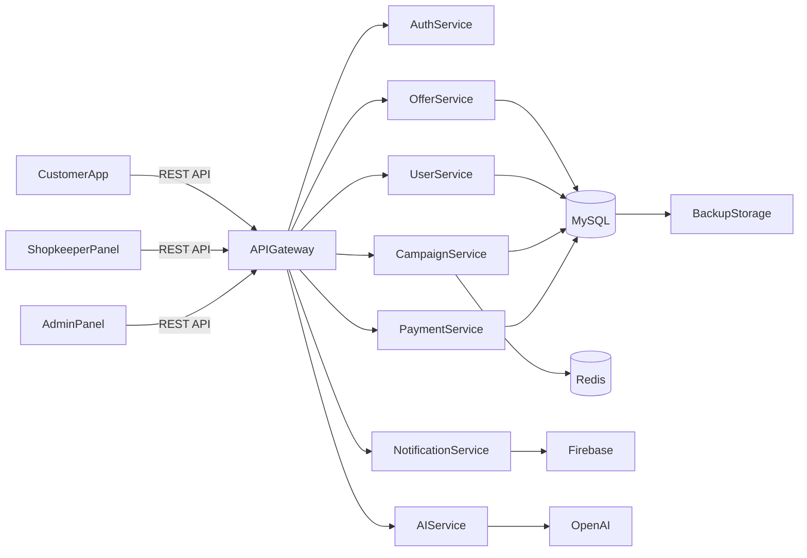
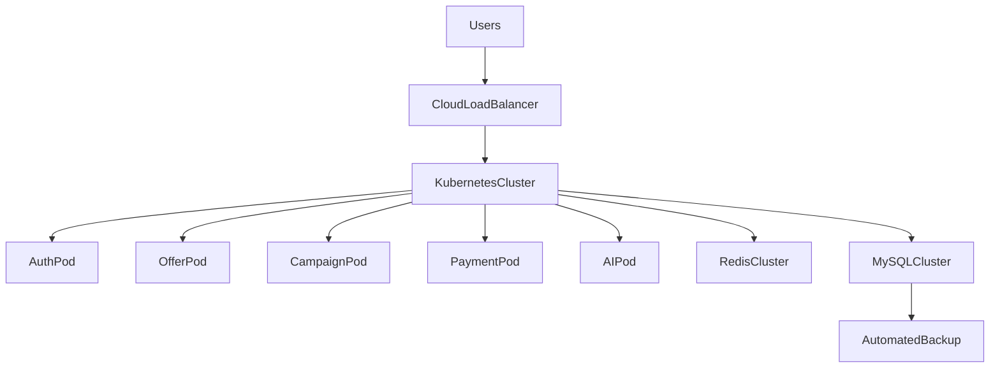
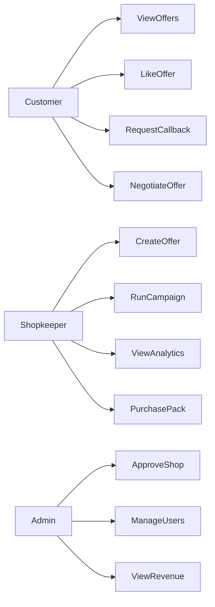
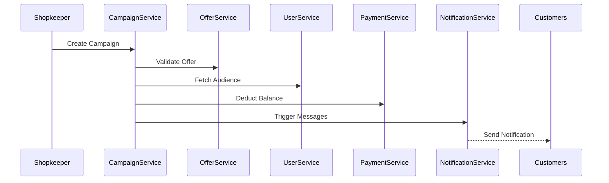
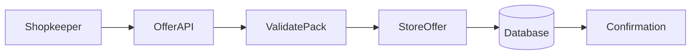
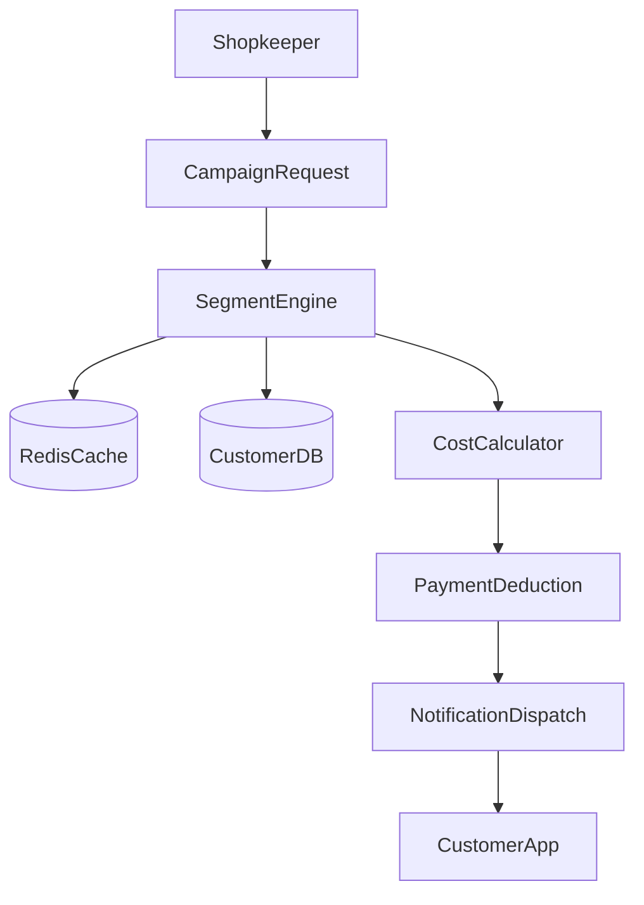

# D'Offer System Architecture

**Source:** Doffers System Architecture Document V1 (PDF).  
**Purpose:** Restate and refine the system architecture in the repository. Includes current Flutter client mapping (what is implemented vs planned).

---

## Table of Contents

1. [Executive Overview](#1-executive-overview)
2. [High-Level Architecture](#2-high-level-architecture)
3. [Component-Level Backend Services](#3-component-level-backend-services)
4. [Deployment Architecture](#4-deployment-architecture)
5. [Use Case Diagram](#5-use-case-diagram)
6. [Key Sequences and Data Flows](#6-key-sequences-and-data-flows)
7. [AI System Architecture](#7-ai-system-architecture)
8. [Security, Scalability, Monitoring, Monetization](#8-security-scalability-monitoring-monetization)
9. [Current Client Mapping](#9-current-client-mapping)

---

## 1. Executive Overview

D'Offers is an **AI-native hyperlocal commerce platform** connecting customers with nearby store offers in real time. The system enables:

- **Customers** to discover pin-code specific offers
- **Shopkeepers** to create and manage discounts
- **Admins** to control platform governance
- **AI-driven** campaign automation and targeting

The system is designed as a **scalable SaaS platform** with:

- Subscription-based monetization  
- Usage-based campaign billing  

---

## 2. High-Level Architecture

### 2.1 Architecture Style

- Microservices-based backend  
- RESTful API communication  
- JWT-based authentication  
- Event-driven campaign processing  
- AI integration layer  
- Cloud-native scalable deployment  

### 2.2 Logical Architecture Diagram

---

## 3. Component-Level Backend Services

| Service | Capabilities | Current client status |
|--------|--------------|------------------------|
| **Authentication Service** | OTP verification, JWT token generation, role-based access control | **Implemented:** OTP send/verify, token stored in memory; RBAC via role. No JWT refresh or persistent token yet. |
| **User Service** | Customer profile, Shopkeeper profile, Admin controls | **Implemented:** `/auth/me`, update profile; shopkeeper profile GET/PUT. |
| **Offer Service** | Create/Update/Delete offer, scratch card logic, offer pack validation, expiry management | **Partial:** CRUD offers, expiry in model. No scratch card or pack validation in client/backend yet. |
| **Campaign Service** | Audience segmentation, cost calculation, campaign scheduler, WhatsApp & in-app integration | **Not implemented.** |
| **AI Service** | Campaign text generation, banner generation, AI assistant chatbot | **Not implemented.** |
| **Payment Service** | Subscription pack purchase, campaign billing, wallet management, GST invoice generation | **Not implemented.** |
| **Notification Service** | Push notifications, campaign alerts, system alerts | **Not implemented.** |

---

## 4. Deployment Architecture

Target deployment (from PDF):

*Note: Current backend may differ (e.g. single Node/Express server). Above is the target state from the architecture document.*

---

## 5. Use Case Diagram

**Implementation status (client):**

- **Customer:** ViewOffers ✓, LikeOffer ✓. RequestCallback, NegotiateOffer — planned.
- **Shopkeeper:** CreateOffer ✓. RunCampaign, ViewAnalytics, PurchasePack — planned.
- **Admin:** ApproveShop ✓, ManageUsers ✓. ViewRevenue — planned.

---

## 6. Key Sequences and Data Flows

### 6.1 Campaign Flow (Sequence)

### 6.2 Offer Creation Data Flow

### 6.3 Campaign Execution Data Flow

---

## 7. AI System Architecture

### 7.1 AI Text Generation Flow

- **Input:** Product name, discount %, tone, language  
- **Process:** Prompt template injection, context personalization, OpenAI API call, response optimization  
- **Output:** WhatsApp message, in-app message  

### 7.2 AI Banner Generation Flow

- User inputs: shop name, offer %, theme  
- Template selection → dynamic content rendering → AI image enhancement → S3 storage → download and campaign usage  

### 7.3 AI Chatbot Assistant

- **Capabilities:** Create campaign via natural language, check pack balance, suggest best performing offers, provide analytics summary  
- **Architecture:** User Query → NLP Engine → Intent Classification → Service Invocation → Response  

---

## 8. Security, Scalability, Monitoring, Monetization

### 8.1 Security (PDF §9)

- JWT authentication  
- Role-based authorization  
- API rate limiting  
- Encryption at rest (AES-256)  
- HTTPS enforced  
- OTP-based login  

### 8.2 Scalability (PDF §10)

- Horizontal pod scaling  
- Redis caching for segmentation  
- Asynchronous campaign processing  
- Queue-based WhatsApp dispatch  
- Read-replica database scaling  

### 8.3 Monitoring & Observability (PDF §11)

- Prometheus metrics  
- Centralized logging  
- Error alerting  
- Campaign performance dashboards  

### 8.4 Monetization (PDF §12)

- **Revenue streams:** Subscription packs, campaign usage billing; future: featured listings, sponsored offers  
- **Billing model:** Wallet-based deduction, auto-invoice generation, recurring subscription engine  

---

## 9. Current Client Mapping

Summary of PDF components and use cases vs current Flutter client implementation. See `CURRENT_STATE.md` and `lib/services/auth_service.dart`, `lib/services/api_config.dart` for details.

| PDF component / use case | Client status | Notes |
|--------------------------|---------------|--------|
| Auth: OTP, JWT, RBAC | Yes (partial) | OTP + token; no persistent token, no JWT refresh |
| User Service: profiles | Yes | /auth/me, update user, shopkeeper profile |
| Offer Service: CRUD | Yes | createOffer, updateOffer, deleteOffer, getCustomerOffers, getShopkeeperOffers |
| Offer: scratch card, pack validation | No | Not in client or backend |
| Campaign Service | No | Planned Phase 2 |
| AI Service | No | Planned Phase 3 |
| Payment Service | No | Planned Phase 1 (packs) / Phase 2 |
| Notification Service | No | Planned Phase 2 |
| ViewOffers, LikeOffer | Yes | Customer Home, Offers, Favorites |
| CreateOffer | Yes | Shopkeeper Offers tab |
| ApproveShop, ManageUsers | Yes | Admin Shopkeepers, Users tabs |
| RequestCallback, NegotiateOffer | No | Later |
| RunCampaign, ViewAnalytics, PurchasePack | No | Phases 1–2 |
| ViewRevenue | No | Later |

---

*End of System Architecture Documentation*
