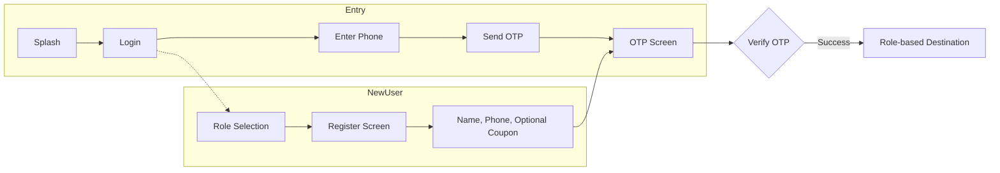
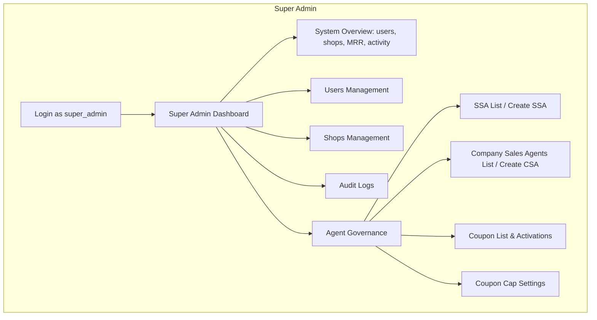
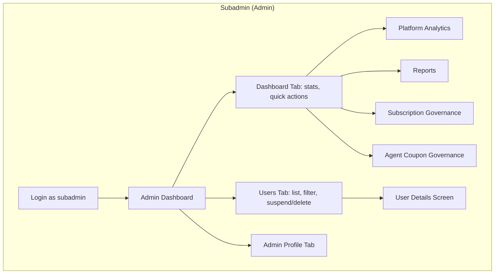
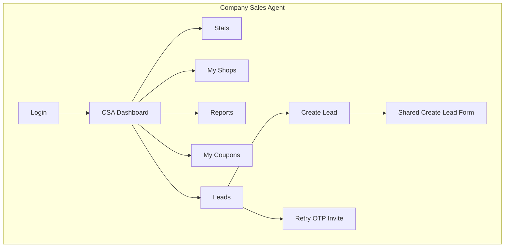
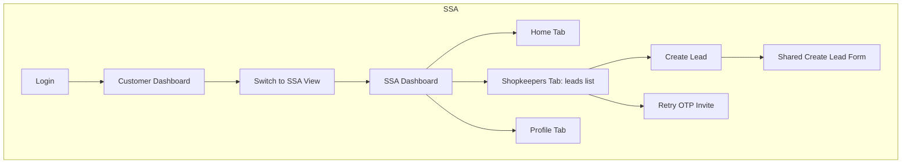
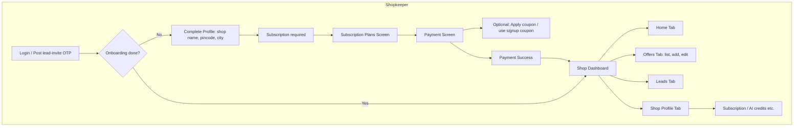
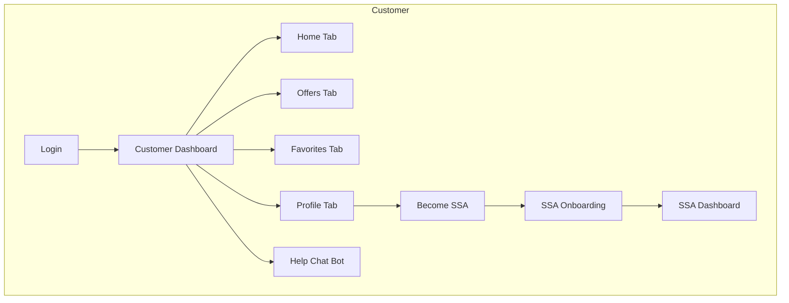
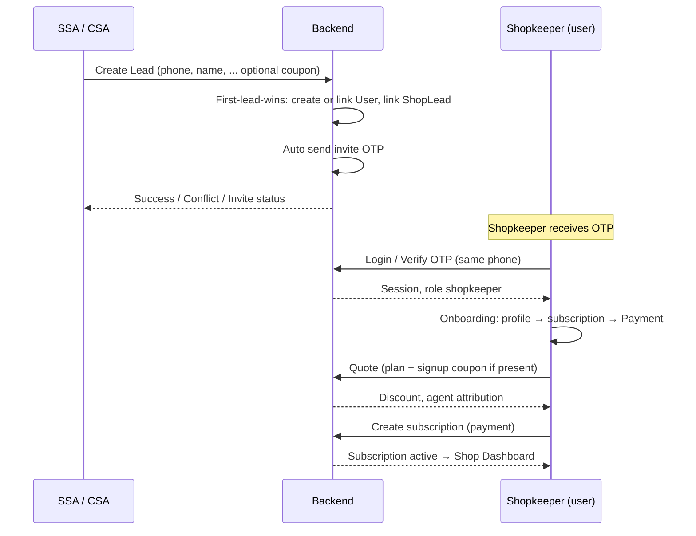
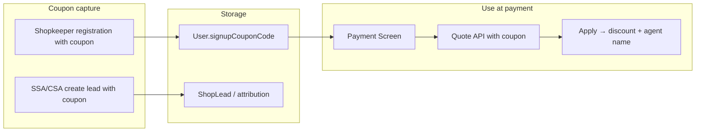

# MyOffers App — Flow Diagram (All 6 Roles)

This document describes the end-to-end app flow **role-wise** so you can see how each role enters the app, what they can do, and how flows connect (e.g. leads → shopkeeper registration → payment with coupons).

---

## 1. Roles Overview

| Role | Description | Post-login default screen |
|------|-------------|---------------------------|
| **Super Admin** | System-wide control: users, shops, audit, agent & coupon governance | Super Admin Dashboard (separate entry) |
| **Subadmin** | Platform admin: users, analytics, reports, subscription & coupon governance | Admin Dashboard |
| **Company Sales Agent (CSA)** | Company-level sales: leads, coupons, shops, reports | CSA Dashboard |
| **SSA** (Store Sales Agent) | Field agent: leads/shopkeepers, can also use app as customer | Customer Dashboard (toggle to SSA Dashboard) |
| **Shopkeeper** | Shop owner: profile, subscription, offers, leads | Onboarding → Shop Dashboard |
| **Customer** | End user: browse offers, favorites, profile, become SSA | Customer Dashboard |

---

## 2. App Entry & Auth (All Roles)



- **Login**: Phone → Send OTP → Enter OTP → Verify → Navigate by role.
- **New user**: Login screen → “Sign up” → Role Selection → Register (name, phone; **shopkeeper** can enter coupon) → OTP → Verify → Navigate by role.
- **Post-OTP destinations** (from code):
  - **customer** → Customer Dashboard  
  - **shopkeeper** → Shop Dashboard (may show Onboarding first)  
  - **admin** (super_admin / subadmin) → Admin Dashboard  
  - **ssa** → Customer Dashboard (with option to switch to SSA view)  
  - **company_sales_agent** → CSA Dashboard  

---

## 3. Role-wise Flows

### 3.1 Super Admin



- **APIs**: `/super-admin/*` (analytics, users, shops, audit), `/agent-governance/*` (SSA, CSA, coupons, settings).
- **Note**: In the client, super_admin and subadmin both map to `UserRole.admin`; Super Admin Dashboard is a separate screen (e.g. reached when backend returns `super_admin` or via dedicated entry).

---

### 3.2 Subadmin (Admin)



- **APIs**: `/admin/*`, `/subscription-governance/*`, agent coupon governance (if exposed for subadmin).
- **Admin Dashboard**: Bottom nav = Dashboard, Users, Admin (profile).

---

### 3.3 Company Sales Agent (CSA)



- **APIs**: `/company-sales/*` (stats, shops, reports, coupons, leads, create lead, retry-invite).
- **Create Lead**: Same shared form as SSA; backend creates/links user (first-lead-wins), sends invite OTP; UI shows success/conflict/invite status.

---

### 3.4 SSA (Store Sales Agent)



- **APIs**: `/ssa/*` (stats, leads, create lead, retry-invite).
- **SSA** lands on Customer Dashboard; profile shows “Customer view” toggle → switch to SSA Dashboard. **Customer** can “Become SSA” from profile → onboarding → SSA Dashboard.

---

### 3.5 Shopkeeper



- **APIs**: `/shopkeeper/*`, `/subscription/*` (plans, quote, create subscription), `/onboarding/*`.
- **Coupon**: Can be captured at **registration** (shopkeeper signup or when created via lead). **Payment screen** prefills signup coupon, user can Apply; quote API returns discount and attribution (e.g. “Referral discount from Agent X”).

---

### 3.6 Customer



- **APIs**: `/customer/*`, `/offers/*`, `/ai/chat`, auth for role upgrade to SSA.

---

## 4. Cross-Role Flows (Leads & Coupons)

### 4.1 Lead → Shopkeeper Registration & Payment



- **First-lead-wins**: One lead per phone; if phone already has a user/lead, API returns conflict.
- **Invite OTP**: After lead create, backend sends OTP; lead list shows invite status and “Retry OTP” if needed.
- **Coupon**: Stored at signup/lead; payment screen uses it in quote and shows “Referral discount from X”.

### 4.2 Coupon Flow (Unified)



- **Governance**: Super Admin uses Agent Governance to manage coupons (list, activations, cap). Subadmin has Agent Coupon Governance screen. CSA/SSA get assigned coupons and use them in lead creation or shopkeeper sees them at registration/payment.

---

## 5. Single-Page Overview (All Roles)

```mermaid
flowchart TB
  subgraph Auth["Auth (all roles)"]
    Splash[Splash] --> Login[Login]
    Login --> OTP[OTP]
    Reg[Role Select → Register] --> OTP
  end

  OTP --> SuperAdmin[Super Admin Dashboard]
  OTP --> Admin[Admin Dashboard]
  OTP --> CSA[CSA Dashboard]
  OTP --> CustomerDash[Customer Dashboard]
  OTP --> ShopDash[Shop Dashboard]
  OTP --> Onboarding[Onboarding Flow]

  CustomerDash --> SSA_Dash[SSA Dashboard]
  CustomerDash --> CustomerTabs[Home | Offers | Favorites | Profile]
  ShopDash --> ShopTabs[Home | Offers | Leads | Shop]
  Onboarding --> ShopDash

  subgraph SuperAdminScreens["Super Admin"]
    SuperAdmin --> Users[Users] --> Shops[Shops] --> Audit[Audit] --> AgentGov[Agent Governance]
  end

  subgraph AdminScreens["Subadmin"]
    Admin --> UsersM[Users] --> Analytics[Analytics] --> Reports[Reports] --> SubGov[Subscription Gov] --> CouponGov[Coupon Gov]
  end

  subgraph CSAScreens["CSA"]
    CSA --> Leads[Leads] --> CreateLead[Create Lead] --> RetryInvite[Retry Invite]
    CSA --> Coupons[Coupons] --> ShopsM[Shops] --> ReportsM[Reports]
  end

  subgraph SSAScreens["SSA"]
    SSA_Dash --> SSA_Leads[Leads] --> SSA_CreateLead[Create Lead] --> SSA_Retry[Retry Invite]
  end

  subgraph ShopkeeperScreens["Shopkeeper"]
    ShopDash --> Payment[Payment + Coupon] --> OffersM[Offers] --> ProfileM[Profile]
  end

  subgraph CustomerScreens["Customer"]
    CustomerTabs --> BecomeSSA[Become SSA] --> SSA_Dash
  end
```

---

## 6. Quick Reference: Screens by Role

| Role | Main screens / actions |
|------|------------------------|
| **Super Admin** | Super Admin Dashboard, Users, Shops, Audit Logs, Agent Governance (SSA/CSA, Coupons, Cap) |
| **Subadmin** | Admin Dashboard (Home, Users, Profile), Platform Analytics, Reports, Subscription Governance, Agent Coupon Governance, User Details |
| **CSA** | CSA Dashboard, Stats, Shops, Reports, Coupons, Leads (create, retry invite) |
| **SSA** | Customer Dashboard ↔ SSA Dashboard (Home, Shopkeepers/Leads, Profile), Create Lead, Retry invite |
| **Shopkeeper** | Onboarding (profile + subscription) → Payment (coupon) → Shop Dashboard (Home, Offers, Leads, Shop) |
| **Customer** | Customer Dashboard (Home, Offers, Favorites, Profile), Become SSA, Help Chat |

---

*Generated from the current codebase (auth, routes, dashboards, lead onboarding, unified coupon flow).*
