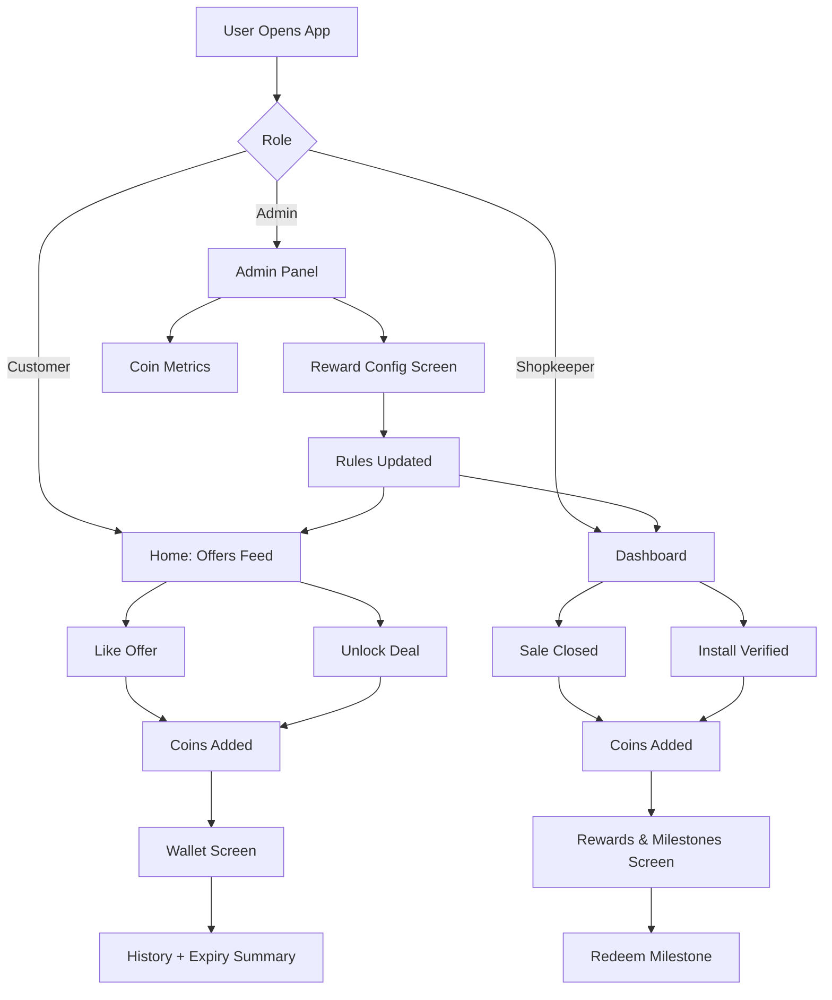
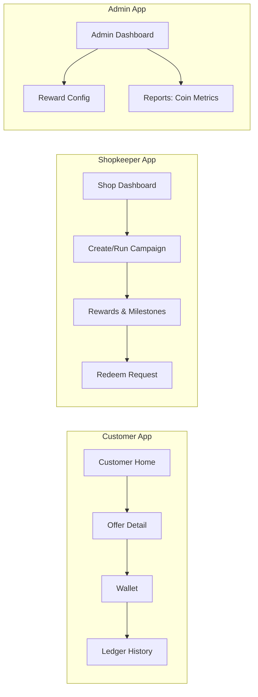

# Coin System: Client Visual Guide (Frontend Only)

This document is made for client walkthroughs.
It explains what users see in the app and how coin actions look from UI perspective.

## 1) Frontend Coin Flow (All Roles)

## 2) Screen Journey (Frontend Visuals)

## 3) What Client Will See in UI

### Customer
- Like offer or unlock deal and coins are credited.
- Wallet screen shows current balance.
- History shows credits/debits and expiry summary.

### Shopkeeper
- Coins are credited on sale closed and install verified events.
- Rewards & Milestones screen shows progress.
- Milestone redeem request can be submitted from UI.

### Admin
- Reward config page to adjust rules and limits.
- Metrics view to monitor coin economy.

## 4) Demo Script (2-Minute Walkthrough)

1. Login as customer.
2. Like one offer, then open wallet and show coin increase.
3. Login as shopkeeper.
4. Trigger sale/install flow and open rewards page.
5. Login as admin and show reward config + coin metrics.

## 5) Note for Internal Team

Backend connection errors do not change the frontend explanation above.
For client demos, use seeded data or staging server with healthy DB connectivity.
