# D-Offers Client Operations Guide

## 1. Executive Snapshot

**D-Offers** is a multi-role hyperlocal commerce platform that connects customers, shopkeepers, field agents, and platform operators in one operating system for local offers, lead conversion, subscriptions, campaigns, rewards, and redemptions.

### Who it serves

| Group | Why they use D-Offers |
|---|---|
| Customers | Discover nearby offers, claim deals, redeem coupons, earn rewards, access loan flow, get AI help |
| Shopkeepers | Onboard, subscribe, publish offers, run campaigns, redeem customer claims, buy AI credits |
| SSA / CSA | Create and manage shop leads, influence onboarding, apply coupon-linked acquisition |
| Subadmin | Run operations, users, analytics, reports, subscriptions, and coupon governance |
| Super Admin | System oversight, shop visibility, audit control, agent creation, coupon activation control |

### Revenue and engagement model

- Shopkeeper subscription plans drive recurring revenue.
- Free starter and trial layers reduce onboarding friction.
- Campaigns create usage-based monetization.
- AI credit packs extend paid value beyond subscription limits.
- Coupon-linked lead onboarding supports agent-driven acquisition.
- Claims, redemption, and coin rewards improve repeat usage.

### Current business value

- One app stack supports 6 operating roles.
- Lead-to-subscription flow is connected, not manual.
- Shopkeeper growth is tracked through agents, coupons, and governance.
- Customer offer discovery is location-first and claim-aware.
- Redemption closes the business loop from offer to sale.
- Rewards add retention for both customer and shopkeeper.
- AI already supports customer help and shopkeeper AI-credit journeys.
- Campaigns are live for in-app inbox delivery and queued expansion.

## 2. Product at a Glance

| Role | Access / Landing | Main screens | Key actions | Business purpose |
|---|---|---|---|---|
| Super Admin | Dedicated super admin flow | Dashboard, shops, users, audit, agent governance | View system metrics, create SSA/CSA, track coupon activations, manage caps | Central control and compliance |
| Subadmin | Admin dashboard | Dashboard, users, analytics, reports, subscription governance, coupon governance | Manage users, approve/reject shops, monitor platform, manage plans | Day-to-day platform operations |
| Company Sales Agent | CSA dashboard | Leads, shops, reports, coupons | Create leads, retry invite OTP, drive onboarding with coupon attribution | Sales-led acquisition |
| SSA | Customer entry with SSA switch | SSA home, shopkeepers, profile | Create leads, share coupon code, retry invites, track conversions | Field onboarding and local expansion |
| Shopkeeper | Onboarding then shop dashboard | Dashboard, offers, campaigns, loans, shop tab | Complete onboarding, subscribe, create offers, run campaigns, redeem coupons, buy AI credits | Merchant growth and monetization |
| Customer | Customer dashboard | Home, offers, claims, loans, favorites, profile, chatbot | Discover offers, like, claim, redeem, earn rewards, apply for loan, become SSA | Demand generation and repeat engagement |

## 3. Basic Technical Foundation

| Layer | Current foundation | Why it matters |
|---|---|---|
| Client | Flutter app | One app experience across roles |
| Backend | Node.js + Express | Central business logic and role routing |
| Database | PostgreSQL + Prisma | Structured role, offer, subscription, campaign, loan, reward, and claim data |
| Identity | OTP login + JWT + role checks | Fast onboarding with controlled access |
| Engines | Subscription, campaign, reward, claim/redemption, loan, AI | Converts discovery into governed business flows |
| Integrations | Gemini AI, Cloudinary uploads, rate limits, coupon governance | Adds support, assets, and operational control |

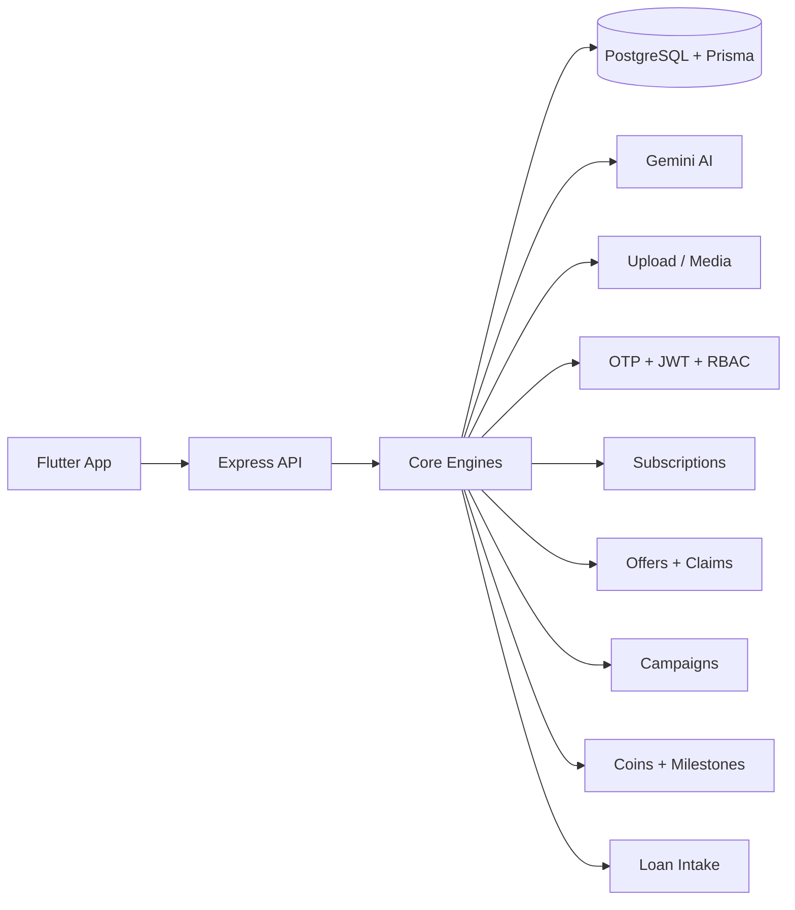

## 4. Unified Login and Role Routing

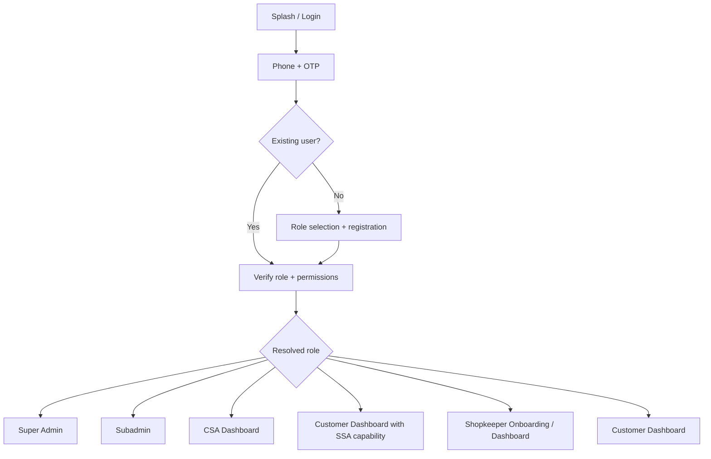

### Routing notes

- `customer` lands on customer dashboard.
- `shopkeeper` enters onboarding until profile and subscription state are ready.
- `ssa` can operate in SSA mode and still has customer capability.
- `company_sales_agent` lands on CSA dashboard.
- `subadmin` lands on admin dashboard.
- `super_admin` has higher-order governance flows.

## 5. Role-Wise Flows

### 5.1 Super Admin

**Objective:** full-system control, agent network governance, and coupon oversight.  
**Entry:** privileged admin login.  
**Default landing:** super admin dashboard.

| Area | What the role sees / controls |
|---|---|
| Analytics | users by role, total shops, subscription status mix, MRR, activity |
| Shop oversight | shop list with subscription view, filters by location and category |
| Audit | audit trail visibility |
| Agent governance | create and view SSA / CSA |
| Coupon control | coupon activations, discount distribution, governance settings |
| Policy control | max coupon discount cap at agent level |

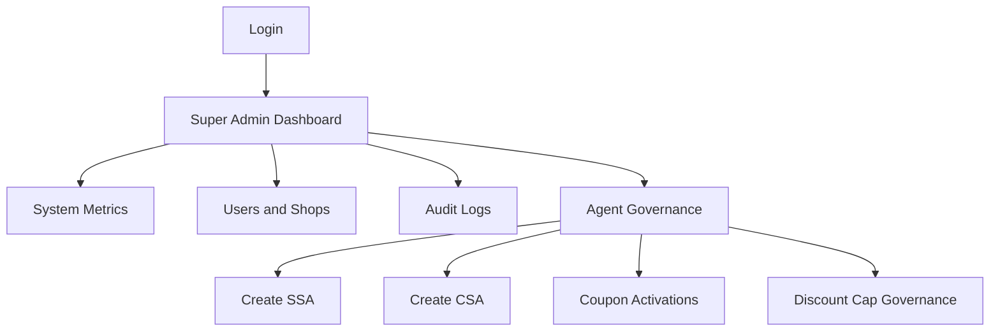

### 5.2 Subadmin

**Objective:** run platform operations without full super admin scope.  
**Entry:** admin login.  
**Default landing:** admin dashboard.

| Area | What it covers |
|---|---|
| User operations | list users, inspect user detail, filter by role/location/category |
| Shop approval | approve or reject pending shopkeepers |
| Analytics | platform-level dashboards |
| Reports | reporting screens |
| Subscription governance | manage plans, subscriptions, analytics, renewals, cancellations |
| Coupon governance | agent and coupon oversight |

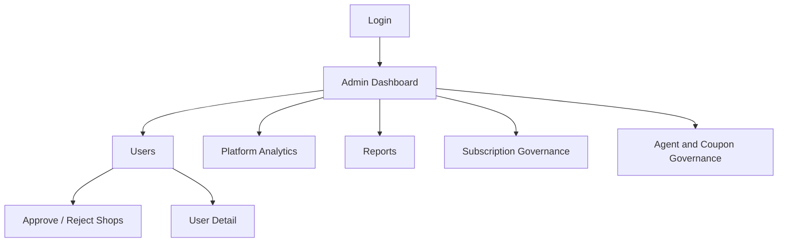

### 5.3 Company Sales Agent

**Objective:** create shopkeeper pipeline and convert leads into active merchants.  
**Entry:** CSA login.  
**Default landing:** CSA dashboard.

| Area | Operational meaning |
|---|---|
| Lead creation | capture shop, owner, phone, location, notes, coupon |
| Invite retry | resend OTP invite when onboarding stalls |
| Coupon influence | coupon can be attached at acquisition stage |
| Pipeline visibility | track open, contacted, converted, or failed invite states |
| Shop tracking | see connected shop base |

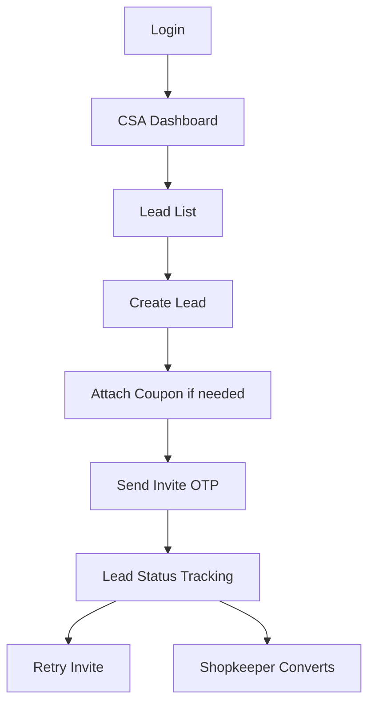

### 5.4 SSA

**Objective:** field-led merchant onboarding with dual customer + agent capability.  
**Entry:** customer-to-SSA upgrade or direct SSA login.  
**Default landing:** customer dashboard or SSA dashboard after switch.

| Area | Operational meaning |
|---|---|
| SSA onboarding | customer becomes SSA with pincode and contact details |
| Role switching | can move between customer experience and SSA workflow |
| Lead handling | create leads, track invite status, retry OTP |
| Coupon use | show and share assigned coupon codes |
| Shop tracking | view onboarded shops and lead movement |

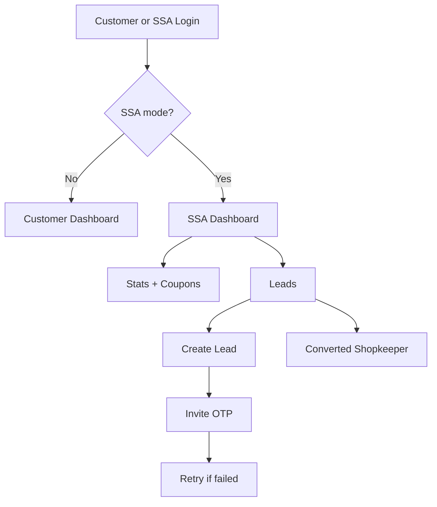

### 5.5 Shopkeeper

**Objective:** become an active merchant, publish deals, run campaigns, redeem claims, and grow via subscription.

| Area | Operational meaning |
|---|---|
| Registration | direct signup or lead-linked invite |
| Onboarding | profile completion, terms, business details |
| Free/trial funnel | auto-trial where eligible, free starter fallback, paid upgrade path |
| Subscription | plan quote, coupon application, payment, plan activation |
| Offer management | create, edit, view, delete offers |
| Campaign usage | audience targeting, cost estimation, draft, pay, queue, launch |
| Redemption | verify and redeem customer claims via QR or manual flow |
| AI credits | use plan allowance and buy extra credit packs |
| Rewards | earn shopkeeper coins and redeem milestones |
| Loans | capital-loan tab available in shop flow |

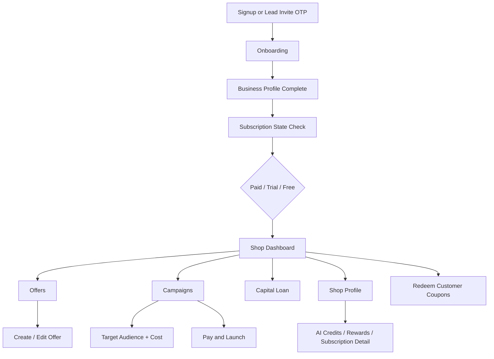

### 5.6 Customer

**Objective:** discover local value, claim deals, redeem them in-store, and stay engaged.

| Area | Operational meaning |
|---|---|
| Home and offers | location-first feed, categories, likes, featured paths |
| Claims | active claimed deals with QR payload and coupon code |
| Favorites | liked offers and saved discovery |
| Redemption outcome | redeemed claims update state and trigger reward flow |
| Wallet visibility | reward balance and history screens |
| AI help | chatbot for offers, coupons, savings, and support |
| Loans | submit and track loan applications |
| SSA path | become SSA from customer journey |

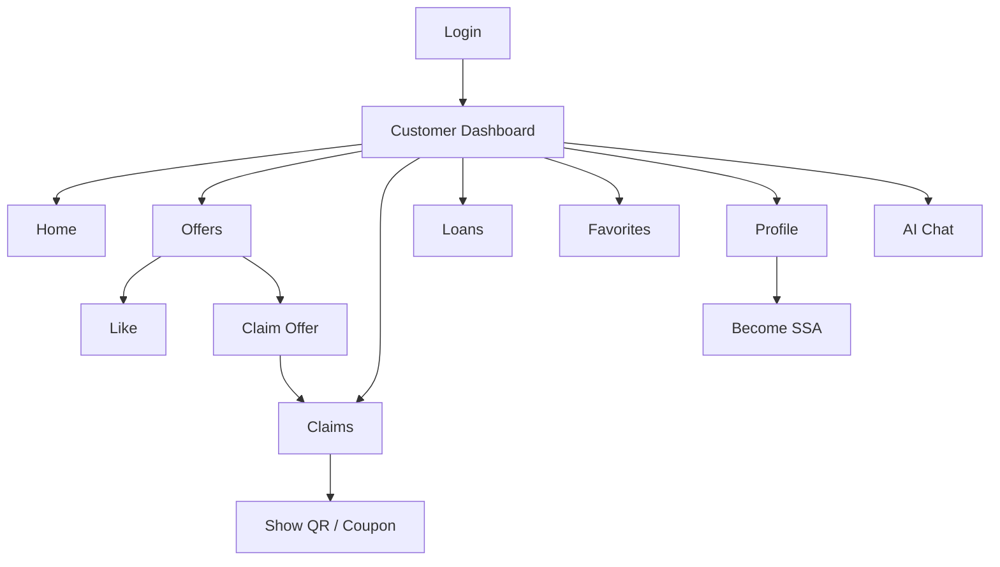

## 6. Cross-Role Business Journeys

### 6.1 Lead to Shopkeeper Onboarding

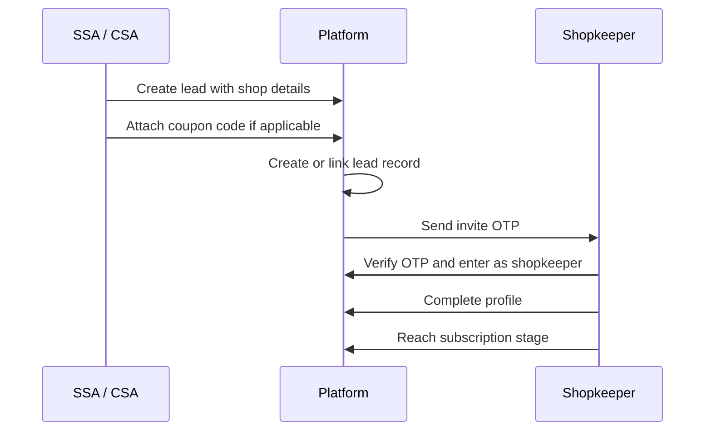

### 6.2 Coupon Capture to Subscription Payment

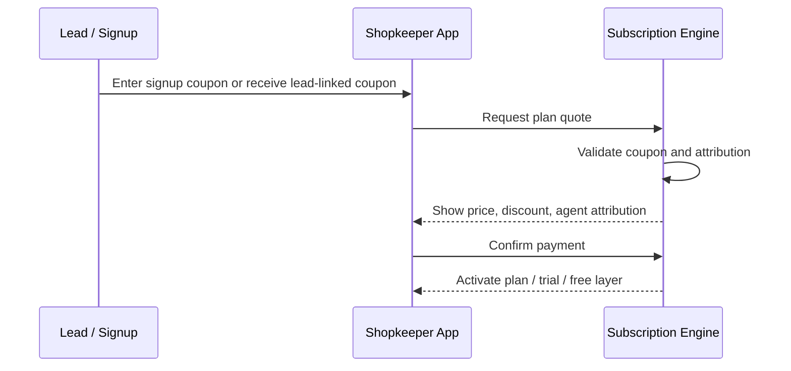

### 6.3 Offer Publish to Customer Claim

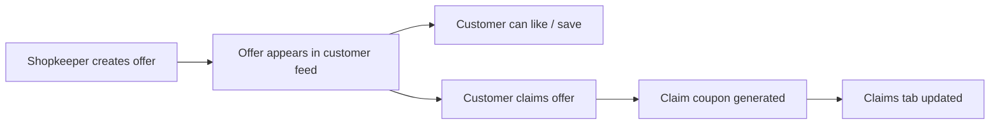

### 6.4 Claim to Redemption to Coin Rewards

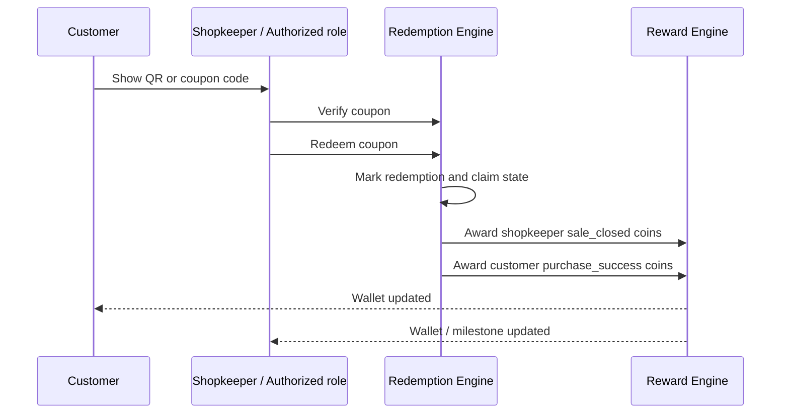

### 6.5 Campaign Lifecycle

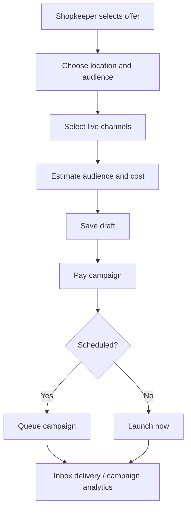

### 6.6 Customer Loan Inquiry Flow

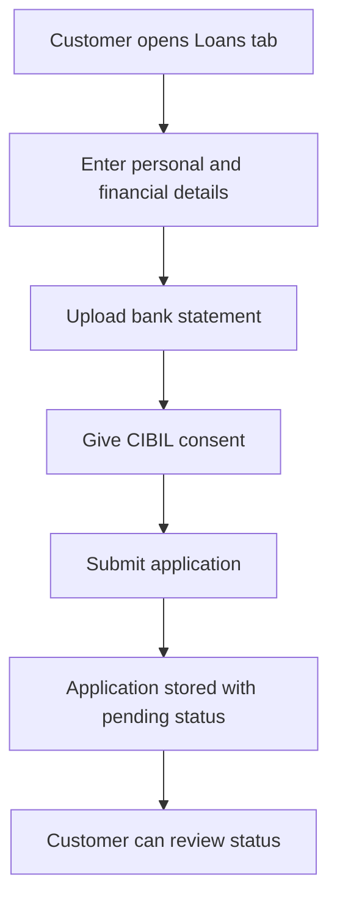

### 6.7 AI-Assisted Journey

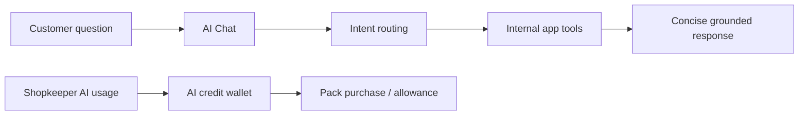

### 6.8 Free / Trial to Paid Conversion

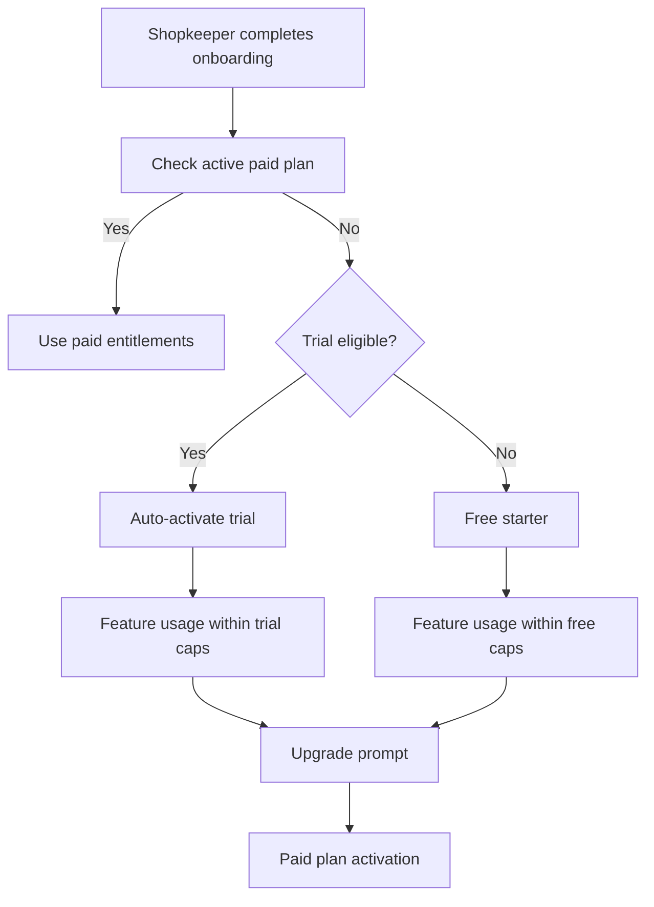

## 7. Module Snapshot

| Module | Purpose | Main users | Status |
|---|---|---|---|
| Auth | OTP login, role routing, access control | All roles | `Live` |
| Onboarding | shopkeeper profile completion and readiness | Shopkeeper, agents | `Live` |
| Offers | create, browse, like, manage offers | Shopkeeper, customer | `Live` |
| Subscriptions | quote, coupon apply, trial/free/paid access | Shopkeeper, admin | `Live` |
| Campaigns | draft, audience estimate, payment, launch, inbox | Shopkeeper | `Live` |
| Rewards / Coins | wallet, ledger, milestones, config | Customer, shopkeeper, admin | `Live` |
| Coupon governance | coupon assignment, activations, discount caps | Super Admin, subadmin, agents | `Live` |
| Claims / Redemptions | claim generation, QR/manual verify, redeem | Customer, shopkeeper, SSA, CSA | `Live` |
| Loans | customer loan intake and tracking | Customer, shopkeeper | `Live` |
| AI chatbot | customer help and app guidance | Customer | `Live` |
| AI credits / packs | merchant AI allowance and top-up | Shopkeeper | `Live` |
| Admin governance | users, reports, analytics, plan control | Subadmin, super admin | `Live` |
| WhatsApp campaign delivery | multi-channel campaign expansion | Shopkeeper | `In rollout` |
| Email / push campaign delivery | additional outbound channels | Shopkeeper | `Announced` |

## 8. Current State and Business Readiness

### Live today

- OTP-based role entry and role-specific dashboards.
- Lead creation with invite retry and coupon-linked acquisition.
- Shopkeeper onboarding with trial / free / paid subscription paths.
- Offer publishing, customer like/favorite behavior, and claim creation.
- Coupon verification and redemption with reward payout.
- Coin wallet, ledger, milestone, and admin reward controls.
- Customer AI chatbot using Gemini.
- Shopkeeper AI credit wallet and extra pack purchase flow.
- Campaign drafting, audience estimation, payment, queueing, and in-app inbox delivery.
- Loan application intake with statement upload and consent capture.

### Recently added / stabilizing

- Campaign analytics gated by plan entitlements.
- Rewards operations and maintenance workflows.
- Claims, QR payload, and redemption-linked payout consistency.
- AI-credit monetization alignment with subscription tiers.
- Trial and free-funnel enforcement across merchant features.

### Reserved for next phase

- Fully live omnichannel campaign delivery beyond in-app inbox.
- Push-notification device pipeline and delivery orchestration.
- Stronger AI content generation and operational copilots.
- Deeper predictive analytics for churn, fraud, and performance actions.
- Better navigation handoffs from AI into exact app actions.

## 9. Operations Notes

- Campaign channels are not equal today: `app_inbox` is live, while broader outbound expansion is still phased.
- Shopkeeper access is feature-gated by subscription status.
- Customer claim and redemption are now part of the core closed-loop commerce flow.
- SSA and CSA are acquisition roles; shopkeeper value starts when onboarding converts into active subscription and offer usage.
- Older documents that describe campaigns, AI, or rewards as "planned" are no longer the correct baseline for client communication.
