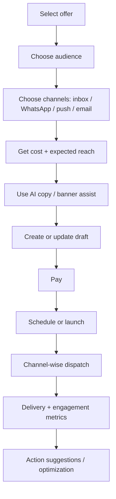
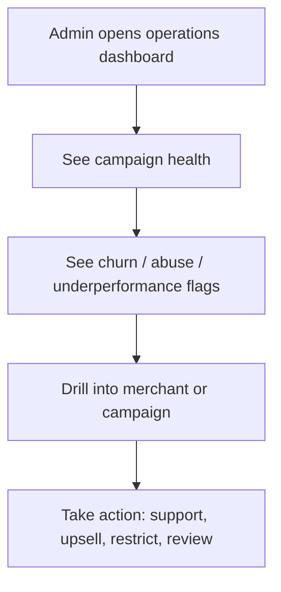
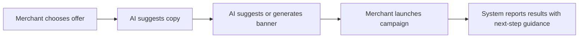

# D-Offers Phase 2 Implementation Brief

## 1. Phase 2 Objective

**Phase 2** should move D-Offers from a working hyperlocal commerce platform into a stronger growth-and-operations engine.

The next phase should focus on three business outcomes:

1. **Expand campaign reach** beyond current in-app inbox delivery.
2. **Improve operator intelligence** so teams act faster and with less manual analysis.
3. **Deepen AI-assisted execution** so merchants and operators do more with fewer steps.

## 2. Current Baseline

The following are already live and are **not** the main Phase 2 build target:

- OTP login and role-based dashboards
- SSA / CSA lead creation and invite retry
- shopkeeper onboarding and subscription journeys
- free / trial / paid monetization flow
- offer creation and customer discovery
- customer likes, favorites, claims
- QR/manual redemption with reward payout
- coin wallet, ledger, milestones, admin reward controls
- customer loan intake
- customer AI chatbot
- shopkeeper AI credits and credit-pack purchase
- campaign draft, estimate, payment, queue, and in-app inbox delivery

### Baseline summary table

| Capability | Current state |
|---|---|
| Campaign creation | Live |
| In-app campaign delivery | Live |
| WhatsApp delivery | Partially staged / not fully live |
| Email delivery | Announced, not live |
| Push delivery | Announced, not live |
| AI help chat | Live |
| AI merchant credit system | Live |
| Claims / redemption / rewards | Live |
| Subscription funnel | Live |

## 3. Phase 2 Capability Blocks

### A. Omnichannel Campaign Expansion

**Goal:** turn campaigns from mainly in-app messaging into a broader merchant growth channel.

**What to add**

- Activate real WhatsApp delivery flow end to end.
- Add push-notification delivery pipeline.
- Add email delivery when applicable.
- Provide channel-wise delivery state, not just campaign state.
- Make scheduled campaigns operationally reliable across channels.

**Why it matters**

- Merchants get broader reach from the same campaign builder.
- Campaign spend becomes easier to justify.
- Platform can introduce channel-wise pricing and packaging later.

### B. Campaign Performance and Operator Visibility

**Goal:** reduce guesswork for shopkeepers, admins, and operators.

**What to add**

- richer campaign performance view
- delivery funnel visibility by channel
- reach, opens, clicks, and campaign efficiency summaries
- plan-aware analytics that explain locked vs unlocked insights
- stronger admin visibility into campaign health and usage trends

**Why it matters**

- Better renewal conversations with merchants.
- Easier identification of high-performing locations, offers, and audience slices.
- Better support and escalation handling for failed or weak campaigns.

### C. AI Content and Decision Assist

**Goal:** move AI from support-only into execution support.

**What to add**

- shopkeeper campaign-copy assist
- banner / creative generation tied to AI-credit usage
- analytics copilot for admins and operators
- guided AI suggestions inside campaign setup

**Why it matters**

- Merchants launch faster.
- Content quality improves without agency dependence.
- Admin teams can explain performance faster.

### D. Smarter Retention and Risk Signals

**Goal:** help the platform act before merchants churn or misuse grows.

**What to add**

- churn-risk indicators for subscriptions
- campaign underperformance flags
- coupon / like / redemption abuse alerts
- operational recommendations for intervention

**Why it matters**

- Protects MRR.
- Improves trust in rewards and coupon systems.
- Gives admin teams a proactive operating layer.

## 4. Role-Wise Impact

| Role | Phase 2 impact |
|---|---|
| Super Admin | Better control over campaign performance, risk signals, and channel rollout governance |
| Subadmin | Better analytics, failure visibility, and intervention tools |
| Company Sales Agent | Stronger merchant sales story with measurable campaign reach and outcomes |
| SSA | Better conversion support through campaign-ready merchant onboarding |
| Shopkeeper | More delivery channels, better campaign outcomes, AI-generated content, clearer ROI |
| Customer | Better-timed outreach, richer campaign messages, more relevant alerts |

## 5. Flow Changes

### 5.1 Campaign flow after Phase 2

### 5.2 Admin operations flow after Phase 2

### 5.3 AI-assisted merchant flow after Phase 2

## 6. Acceptance View

Phase 2 should be considered complete when operations and client stakeholders can clearly observe the following:

### Commercial acceptance

- A merchant can run the same campaign through more than one effective delivery channel.
- Campaign results are visible in business terms, not only technical status.
- AI helps merchants create launch-ready campaign assets faster.

### Operational acceptance

- Admin teams can see which campaigns delivered, failed, underperformed, or need intervention.
- Support teams can identify whether the issue is audience, channel, pricing, or execution.
- Governance teams can spot abuse or risk patterns earlier.

### Product acceptance

- Shopkeepers feel campaign value is measurable.
- Customers receive more relevant and better-timed outreach.
- The platform can explain why a merchant should renew, upgrade, or buy more usage.

## 7. Suggested Phase 2 Scope Boundary

### In scope

- WhatsApp / push / email campaign rollout
- stronger campaign reporting
- AI campaign-content assist
- operator insight layer
- risk and retention signals

### Out of scope for this Phase 2

- full marketplace redesign
- role-model changes
- reworking core claim / redemption / reward logic
- replacing the subscription foundation

## 8. Business Readout

Phase 1 established the operating rails: onboarding, subscriptions, offers, claims, redemption, rewards, campaigns, loans, and AI help.

**Phase 2 should now turn those rails into measurable scale.**

That means:

- more campaign reach
- more visible merchant ROI
- more admin intelligence
- more AI-assisted execution
- more predictable retention and governance
