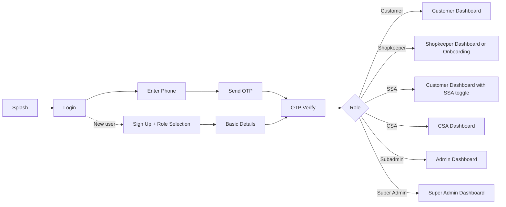
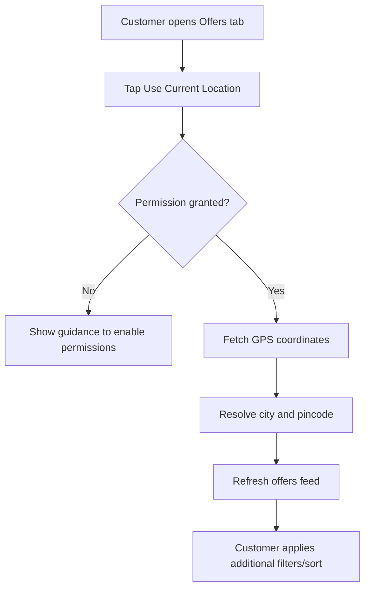
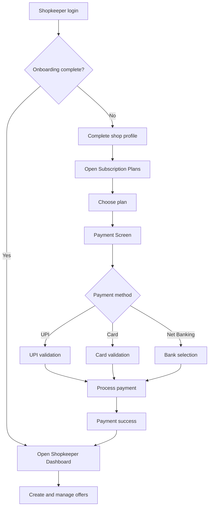
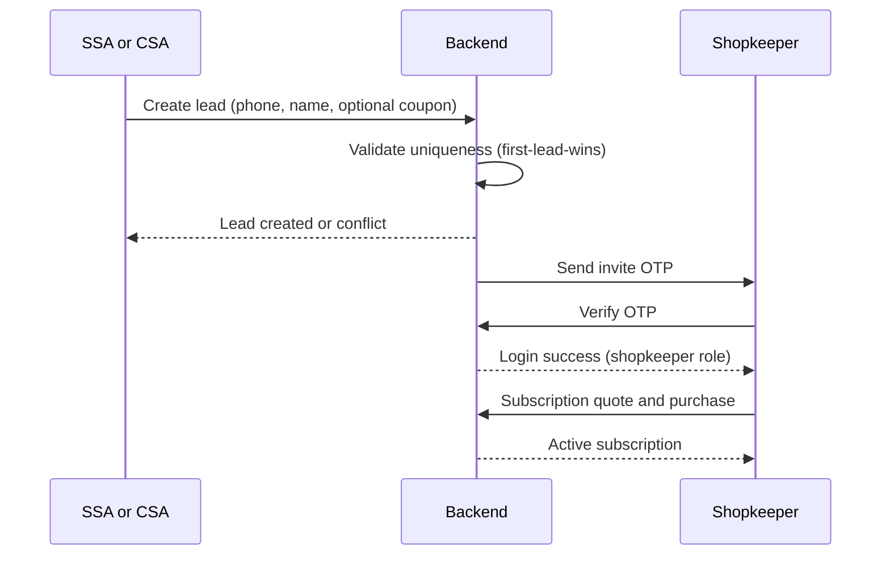
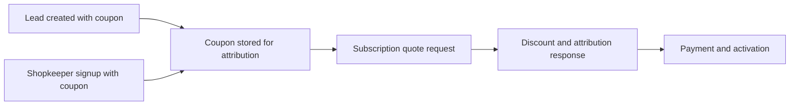

# D-OFFERS End-to-End Walkthrough (English)

Purpose: This document explains how the application behaves from a user-flow perspective across all roles. It is focused on practical app usage (screens and journeys), not deep implementation internals.

## Table of Contents

1. Product at a glance
2. Role map
3. Universal login and routing flow
4. Customer journey
5. Shopkeeper onboarding and subscription journey
6. SSA and CSA lead journey
7. Admin and Super Admin control journey
8. Cross-role coupon and lead lifecycle
9. Current implementation status
10. Common operational issues

## 1) Product at a glance

D-OFFERS is a multi-role platform where:
- Customers discover local offers.
- Shopkeepers subscribe and publish offers.
- SSA/CSA drive lead acquisition and conversion.
- Admin and Super Admin govern users, coupons, and platform health.

## 2) Role map

- Customer: Browse, filter, and save offers.
- Shopkeeper: Complete onboarding, subscribe, create offers.
- SSA: Field-level lead creation and invitation retries.
- CSA: Company-level sales pipeline and coupon-aligned lead flow.
- Subadmin: Day-to-day platform operations.
- Super Admin: Global governance and audit control.

## 3) Universal login and role-based routing

All roles pass through the same auth entry points (phone + OTP), then route to role-specific destinations.

## 4) Customer journey

### Main flow

1. Customer lands on dashboard.
2. Opens offers feed.
3. Applies search, filters, and sorting.
4. Opens offer details.
5. Likes/saves offers in favorites.

### Location-based discovery

1. Customer taps Use Current Location.
2. App requests location permission.
3. GPS coordinates are fetched.
4. Reverse geocoding resolves city/pincode.
5. Feed refreshes using location context.

## 5) Shopkeeper onboarding and subscription journey

This is the primary monetization path.

1. Shopkeeper logs in via OTP.
2. If onboarding is incomplete, profile completion is required.
3. Shopkeeper selects a subscription plan.
4. Payment method is selected and validated.
5. Payment success activates subscription state.
6. Shopkeeper gains full access to offer management.

### Payment methods currently modeled

- UPI flow
- Card flow
- Net banking flow
- Success callback route back to subscription context

## 6) SSA and CSA lead journey

SSA and CSA share similar lead creation behavior with different organizational scope.

1. Agent creates lead using phone and profile details.
2. Optional coupon can be captured in lead stage.
3. Invite OTP is sent to lead phone.
4. Shopkeeper authenticates and enters onboarding/subscription flow.
5. Lead attribution stays linked to agent context.

## 7) Admin and Super Admin control journey

### Subadmin

- Monitor dashboard stats.
- Manage users.
- Access reports and subscription governance.
- Access agent/coupon governance screens.

### Super Admin

- Monitor full-system analytics.
- Manage agents (SSA/CSA) and coupon lifecycle.
- Review audit logs and system-wide controls.
- Configure coupon policies and high-level governance.

## 8) Cross-role coupon and lead lifecycle

Coupons can enter the system at registration or lead creation, then influence subscription quote outcomes.

## 9) Current implementation status

The following are reflected as completed in project tracking documents:
- Agent and coupon governance modules (core admin pathways).
- Create SSA and Create CSA screens with validation and location assistance.
- Pincode-based location autofill patterns.
- Customer current-location offer discovery flow.
- Shopkeeper payment experience (modeled gateway behavior).

## 10) Common operational issues and quick triage

- OTP not received:
- validate phone format and resend timing
- verify SMS transport availability

- Location not detected:
- verify location services
- verify app permissions

- Payment cannot proceed:
- check required fields for selected method
- verify method-specific validation state

- Role navigation mismatch:
- verify role assignment and route mapping in auth response

## Practical summary

- One entry path, role-based destinations.
- Customer value: fast local offer discovery.
- Shopkeeper value: onboarding -> subscription -> offer publishing.
- SSA/CSA value: lead generation and conversion pipeline.
- Admin value: governance and platform control.

---

This walkthrough is intentionally app-flow oriented. For deeper internals (schema, service-level architecture, and low-level APIs), use the dedicated architecture and system documentation set.
