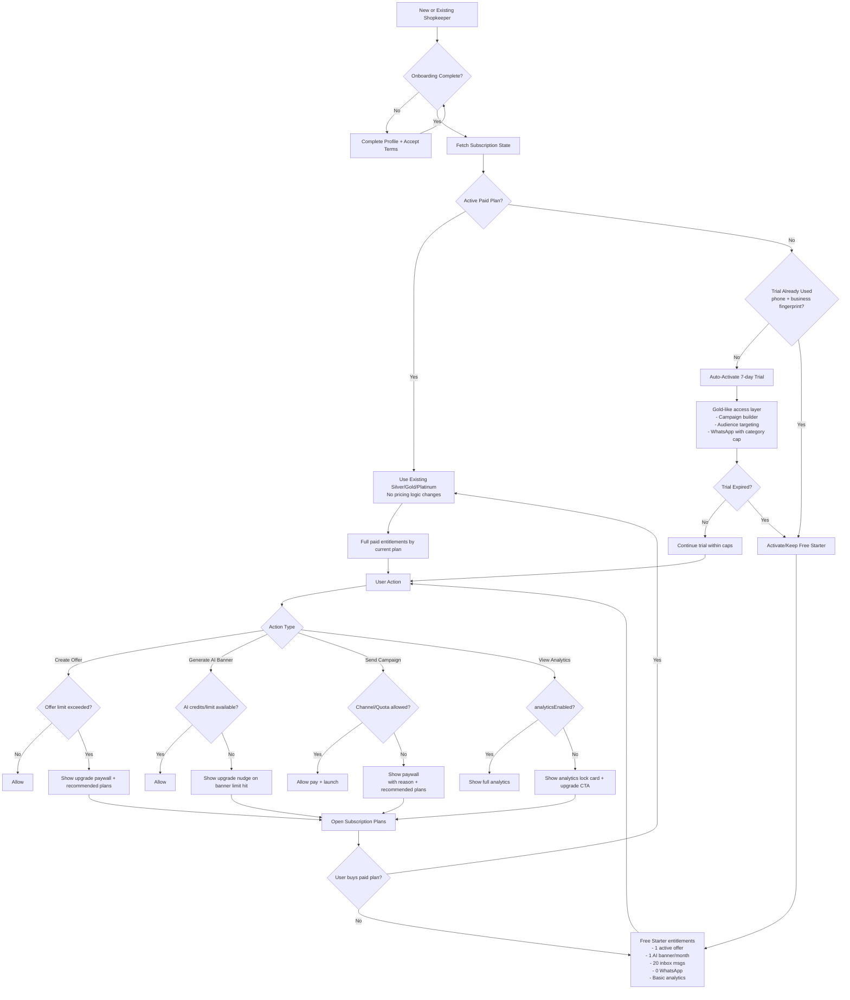

# Free + Trial Funnel Flow Diagram

## Notes
- Paid plans remain unchanged; Free and Trial act as acquisition layers.
- Trial is one-time per business using phone + hashed business fingerprint.
- Trial WhatsApp cap is category-wise and configurable via app settings.
- Post-trial fallback is automatic to Free Starter.
