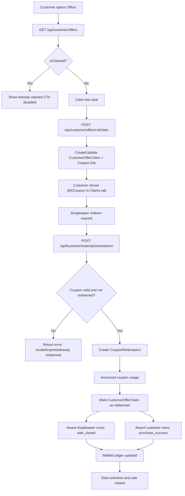

# Unlock Deal Flow (Short + Robust)

This flow covers the complete customer-to-shopkeeper deal unlock lifecycle: discover -> claim -> redeem -> rewards.

## Goal
- Customer unlocks a deal by claiming it.
- Shopkeeper closes the sale by redeeming the coupon.
- Both sides receive coins after successful sale closure.

## Actors
- Customer
- Shopkeeper (or authorized business role for redemption)
- Backend APIs
- Reward Engine

## End-to-End Steps
1. Customer opens offer feed (`/api/customer/offers`).
2. Backend returns offers with:
- `isLiked`
- `isClaimed`
3. Offer Details shows CTA state:
- If `isClaimed=true` -> disabled CTA: "Already claimed ✓"
- Else -> active "Claim this deal"
4. Customer claims offer (`POST /api/customer/offers/:id/claim`).
5. Backend creates/activates claim + coupon link (`CustomerOfferClaim`).
6. Customer visits Claims tab and shows QR/coupon to shopkeeper.
7. Shopkeeper verifies and redeems (`POST /api/business/redemptions/redeem`).
8. Redemption service updates:
- `CouponRedemption` created
- coupon usage incremented
- all active `CustomerOfferClaim` rows for that coupon marked `redeemed`
9. Reward engine awards coins on successful redemption:
- Shopkeeper: `sale_closed`
- Customer(s): `purchase_success`
10. Wallet/ledger endpoints reflect updated balances.

## Core Data Objects
- `Offer`
- `CustomerOfferClaim`
- `Coupon`
- `CouponRedemption`
- `CoinWallet`
- `CoinLedgerEntry`

## Guards & Idempotency
- Claim permissions checked with effective roles (`customer` or dual-role policy).
- Redemption supports idempotency key to prevent duplicate sale closure.
- Rewards are awarded only on non-replay successful redemption.

## Failure Handling (Expected)
- Invalid/expired coupon -> redeem blocked.
- Already redeemed -> conflict response.
- Missing claim capability -> claim blocked at UI + API.
- Reward failure does not roll back redemption (sale remains closed), but logs are emitted.

## Mermaid Diagram

## Quick Verification Checklist
- Offer feed returns `isClaimed` for logged-in customer.
- Claimed offer shows disabled CTA in Offer Details.
- Redemption closes sale once per coupon-offer pair.
- After redemption:
- Shopkeeper wallet balance increases.
- Customer wallet balance increases.
- No duplicate rewards on idempotent replay.
